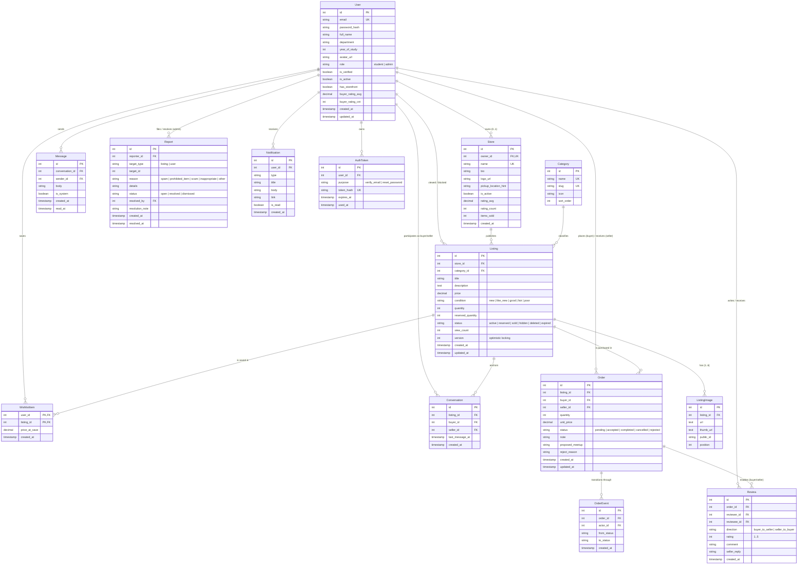

# CampusMart — Entity-Relationship Diagram

```mermaid
erDiagram
    User ||--o{ Store : "owns (0..1)"
    User ||--o{ Listing : "viewed / blocked"
    User ||--o{ WishlistItem : "saves"
    User ||--o{ Conversation : "participates as buyer/seller"
    User ||--o{ Message : "sends"
    User ||--o{ Order : "places (buyer) / receives (seller)"
    User ||--o{ Review : "writes / receives"
    User ||--o{ Report : "files / resolves (admin)"
    User ||--o{ Notification : "receives"
    User ||--o{ AuthToken : "owns"

    Store ||--o{ Listing : "publishes"
    Category ||--o{ Listing : "classifies"
    Listing ||--o{ ListingImage : "has (1..6)"
    Listing ||--o{ WishlistItem : "is saved in"
    Listing ||--o{ Conversation : "anchors"
    Listing ||--o{ Order : "is purchased in"

    Order ||--o{ OrderEvent : "transitions through"
    Order ||--o{ Review : "enables (buyer/seller)"

    User {
        int id PK
        string email UK
        string password_hash
        string full_name
        string department
        int year_of_study
        string avatar_url
        string role "student | admin"
        boolean is_verified
        boolean is_active
        boolean has_storefront
        decimal buyer_rating_avg
        int buyer_rating_cnt
        timestamp created_at
        timestamp updated_at
    }

    Store {
        int id PK
        int owner_id FK, UK
        string name UK
        string bio
        string logo_url
        string pickup_location_hint
        boolean is_active
        decimal rating_avg
        int rating_count
        int items_sold
        timestamp created_at
    }

    Category {
        int id PK
        string name UK
        string slug UK
        string icon
        int sort_order
    }

    Listing {
        int id PK
        int store_id FK
        int category_id FK
        string title
        text description
        decimal price
        string condition "new | like_new | good | fair | poor"
        int quantity
        int reserved_quantity
        string status "active | reserved | sold | hidden | deleted | expired"
        int view_count
        int version "optimistic locking"
        timestamp created_at
        timestamp updated_at
    }

    ListingImage {
        int id PK
        int listing_id FK
        text url
        text thumb_url
        string public_id
        int position
    }

    WishlistItem {
        int user_id PK, FK
        int listing_id PK, FK
        decimal price_at_save
        timestamp created_at
    }

    Conversation {
        int id PK
        int listing_id FK
        int buyer_id FK
        int seller_id FK
        timestamp last_message_at
        timestamp created_at
    }

    Message {
        int id PK
        int conversation_id FK
        int sender_id FK
        string body
        boolean is_system
        timestamp created_at
        timestamp read_at
    }

    Order {
        int id PK
        int listing_id FK
        int buyer_id FK
        int seller_id FK
        int quantity
        decimal unit_price
        string status "pending | accepted | completed | cancelled | rejected"
        string note
        string proposed_meetup
        string reject_reason
        timestamp created_at
        timestamp updated_at
    }

    OrderEvent {
        int id PK
        int order_id FK
        int actor_id FK
        string from_status
        string to_status
        timestamp created_at
    }

    Review {
        int id PK
        int order_id FK
        int reviewer_id FK
        int reviewee_id FK
        string direction "buyer_to_seller | seller_to_buyer"
        int rating "1..5"
        string comment
        string seller_reply
        timestamp created_at
    }

    Report {
        int id PK
        int reporter_id FK
        string target_type "listing | user"
        int target_id
        string reason "spam | prohibited_item | scam | inappropriate | other"
        string details
        string status "open | resolved | dismissed"
        int resolved_by FK
        string resolution_note
        timestamp created_at
        timestamp resolved_at
    }

    Notification {
        int id PK
        int user_id FK
        string type
        string title
        string body
        string link
        boolean is_read
        timestamp created_at
    }

    AuthToken {
        int id PK
        int user_id FK
        string purpose "verify_email | reset_password"
        string token_hash UK
        timestamp expires_at
        timestamp used_at
    }
```
